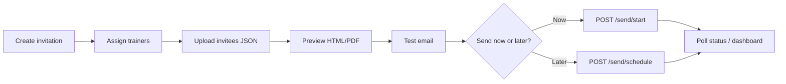

# Invitation Management — Frontend Integration Guide

This document describes how the React (or other) frontend should integrate with the **Invitation Campaign API** implemented in `africanhub-api`. It covers user flows, endpoints, request payloads, and response shapes.

---

## Base URL & authentication

| Item | Value |
|------|--------|
| Base path | `/api/invitations` (and nested routes below) |
| Auth | **JWT required** on every endpoint (`Authorization: Bearer <token>`) |
| Content-Type | `application/json` unless noted (file uploads use `multipart/form-data`) |

### Standard JSON envelope

Most endpoints return:

```json
{
  "status": "success" | "error",
  "message": "Human-readable message (optional on success, required on many errors)",
  "data": { }
}
```

HTTP status codes: `200` / `201` success, `400` validation, `404` not found, `500` server error.

**Exceptions** (binary / raw responses):

- `GET .../preview/html?format=html` → raw `text/html`
- `GET .../preview/pdf` → `application/pdf` file download
- `GET .../template` → `text/html` file download

---

## Recommended user workflow

The backend expects campaigns to move through these steps. The frontend should guide users in this order:



| Step | Frontend screen | Primary API calls |
|------|-----------------|-------------------|
| 1 | Create invitation | `POST /api/invitations` |
| 2 | Trainer picker | `GET /api/invitations/trainers`, `POST .../trainers` (create), `POST /api/invitations/{id}/trainers` |
| 3 | Upload invitees | Parse Excel **in browser**, then `POST .../invitees/validate` → `POST .../invitees` |
| 4 | Validation summary | Show `summary` + table from validate/save response |
| 5 | PDF preview | `GET .../preview/html`, `GET .../preview/pdf` |
| 6 | Test email | `POST .../send/test` |
| 7 | Send campaign | `POST .../send/start` or `POST .../send/schedule` |
| 8 | Dashboard | Poll `GET /api/invitations/{id}` and `GET .../invitees/summary` |

---

## Status values (enums)

### Invitation campaign (`invitation.status`)

| Value | Meaning | Frontend notes |
|-------|---------|----------------|
| `DRAFT` | Created; invitees not saved or none valid | Editable; cannot batch-send |
| `VALIDATED` | At least one valid invitee saved | Editable; ready to preview/send |
| `SCHEDULED` | Send scheduled for future `scheduled_at` | Editable; use `force=true` to send early |
| `PROCESSING` | Batch send in progress | **Not editable**; poll for progress |
| `COMPLETED` | All sends finished | Read-only |
| `CANCELLED` | Soft-cancelled via DELETE | Read-only |

**Editable statuses** (update invitation, invitees, trainers, template): `DRAFT`, `VALIDATED`, `SCHEDULED`.

### Invitee validation (`validation_status`)

| Value | Meaning |
|-------|---------|
| `PENDING` | Initial (unused after upload; upload sets VALID/INVALID/DUPLICATE) |
| `VALID` | Eligible to receive email |
| `INVALID` | Missing/invalid name or email |
| `DUPLICATE` | Duplicate email in the same upload (first row wins as VALID) |

### Invitee send (`send_status`)

| Value | Meaning |
|-------|---------|
| `PENDING` | Not sent yet |
| `SENDING` | In flight (transient during batch) |
| `SENT` | Email accepted by provider |
| `FAILED` | Send failed; see `error_message` |

Only invitees with `validation_status === "VALID"` are included in batch sending.

---

## Shared data shapes

### Trainer object

```json
{
  "id": 1,
  "full_name": "Dr. Jane Mwangi",
  "designation": "Lead Facilitator",
  "bio": "…",
  "qualifications": "CPA, PhD",
  "photo": "https://…/storage/invitation_trainers/jane-abc123.jpg",
  "is_active": true,
  "created_by": 5,
  "updated_by": 5,
  "created_at": "2025-06-10T08:00:00",
  "updated_at": "2025-06-10T08:00:00"
}
```

When nested under an invitation, trainers also include:

```json
{
  "display_order": 0,
  "assignment_id": 12
}
```

### Invitee input (from Excel parsing)

The **frontend parses Excel** (XLSX/XLS). Expected columns:

| Column | Required |
|--------|----------|
| Full Name | Yes |
| Email | Yes |
| Address | No |
| Organization | No |

Send to API as:

```json
{
  "full_name": "John Doe",
  "email": "john@example.com",
  "address": "Dar es Salaam",
  "organization": "ACME Ltd"
}
```

Max **5,000** invitees per request.

### Invitee object (saved)

```json
{
  "id": 101,
  "full_name": "John Doe",
  "email": "john@example.com",
  "address": "Dar es Salaam",
  "organization": "ACME Ltd",
  "validation_status": "VALID",
  "validation_message": null,
  "send_status": "PENDING",
  "error_message": null,
  "sent_at": null,
  "processed_at": null,
  "created_at": "2025-06-10T09:00:00"
}
```

### Invitee summary object

```json
{
  "total": 100,
  "valid": 92,
  "invalid": 5,
  "duplicate": 3,
  "pending_send": 90,
  "sent": 2,
  "failed": 0
}
```

### Full invitation object

Returned by create/get/update/list item:

```json
{
  "id": 1,
  "title": "June 2025 Tax Workshop",
  "course_title": "Advanced Tax Planning",
  "course_description": "…",
  "venue": "Dar es Salaam",
  "start_date": "2025-06-15",
  "end_date": "2025-06-17",
  "start_time": "09:00:00",
  "end_time": "16:00:00",
  "learning_outcomes": "Outcome 1\nOutcome 2",
  "source_email": "trainings@africanhub.ac.tz",
  "email_subject": "Invitation: [NAME] — Advanced Tax Planning",
  "email_message": "Dear [NAME],\n\nWe are pleased to invite you…",
  "course_fee": 150000.0,
  "deposit_amount": 50000.0,
  "reservation_deadline": "2025-06-10",
  "bank_account_name": "The African Hub",
  "bank_account_number": "0123456789",
  "bank_name": "NMB Bank",
  "interval_seconds": 10,
  "interval_limit": 5,
  "scheduled_at": null,
  "has_template": false,
  "invitation_template_filename": null,
  "status": "VALIDATED",
  "started_at": null,
  "completed_at": null,
  "created_by": 5,
  "updated_by": 5,
  "created_at": "2025-06-10T08:00:00",
  "updated_at": "2025-06-10T09:30:00",
  "trainers": [ ],
  "invitee_counts": {
    "total": 100,
    "valid": 92,
    "invalid": 5,
    "duplicate": 3,
    "pending_send": 92,
    "sent": 0,
    "failed": 0
  }
}
```

### Date/time formats

| Field | Format |
|-------|--------|
| Dates (`start_date`, `end_date`, `reservation_deadline`) | `YYYY-MM-DD` (also accepts `DD/MM/YYYY` on input) |
| Times (`start_time`, `end_time`) | `HH:MM` or `HH:MM:SS` |
| `scheduled_at` | `YYYY-MM-DDTHH:MM:SS` or `YYYY-MM-DD HH:MM:SS` |

### Email placeholders

`email_subject` and `email_message` support **`[NAME]`**, replaced per invitee with their `full_name` at send time.

---

## API reference

### Trainers (master pool)

#### List trainers

```
GET /api/invitations/trainers?active_only=true
```

| Query | Default | Description |
|-------|---------|-------------|
| `active_only` | `true` | Set `false` to include deactivated trainers |

**Response `data`:** array of trainer objects.

---

#### Get trainer

```
GET /api/invitations/trainers/{trainer_id}
```

**Response `data`:** trainer object.

---

#### Create trainer

```
POST /api/invitations/trainers
```

**Option A — JSON**

```json
{
  "full_name": "Dr. Jane Mwangi",
  "designation": "Lead Facilitator",
  "bio": "…",
  "qualifications": "CPA",
  "photo": "https://…"
}
```

**Option B — multipart/form-data**

| Field | Type | Required |
|-------|------|----------|
| `full_name` | string | Yes |
| `designation` | string | No |
| `bio` | string | No |
| `qualifications` | string | No |
| `photo` | file | No (jpg, png, gif, webp) |

**Response `201`:**

```json
{
  "status": "success",
  "message": "Trainer created",
  "data": { }
}
```

---

#### Update trainer

```
PUT /api/invitations/trainers/{trainer_id}
```

Same body as create (JSON or multipart). Include `is_active: true|false` to reactivate.

**Response `data`:** updated trainer object.

---

#### Deactivate trainer

```
DELETE /api/invitations/trainers/{trainer_id}
```

Soft-delete (`is_active = false`).

**Response:**

```json
{
  "status": "success",
  "message": "Trainer deactivated"
}
```

---

### Invitations (campaigns)

#### Create invitation

```
POST /api/invitations
```

**Required fields:**

```json
{
  "title": "June 2025 Tax Workshop",
  "course_title": "Advanced Tax Planning",
  "course_description": "Full course description…",
  "venue": "Dar es Salaam",
  "start_date": "2025-06-15",
  "end_date": "2025-06-17",
  "start_time": "09:00",
  "end_time": "16:00",
  "source_email": "trainings@africanhub.ac.tz",
  "email_subject": "Invitation: [NAME]",
  "email_message": "Dear [NAME],\n\n…"
}
```

**Optional fields:**

```json
{
  "learning_outcomes": "Line 1\nLine 2",
  "course_fee": 150000,
  "deposit_amount": 50000,
  "reservation_deadline": "2025-06-10",
  "bank_account_name": "The African Hub",
  "bank_account_number": "0123456789",
  "bank_name": "NMB Bank",
  "interval_seconds": 10,
  "interval_limit": 5,
  "trainer_ids": [1, 2]
}
```

**Response `201`:** full invitation object in `data`. Initial `status` is `DRAFT`.

---

#### List invitations

```
GET /api/invitations?page=1&per_page=20&status=VALIDATED
```

| Query | Default | Description |
|-------|---------|-------------|
| `page` | `1` | Page number |
| `per_page` | `20` | Max 100 |
| `status` | — | Filter: `DRAFT`, `VALIDATED`, `SCHEDULED`, `PROCESSING`, `COMPLETED`, `CANCELLED` |

**Response `data`:**

```json
{
  "invitations": [ ],
  "pagination": {
    "total": 45,
    "page": 1,
    "per_page": 20,
    "total_pages": 3
  }
}
```

List items omit nested `trainers` detail (`include_trainers=false`) but include `invitee_counts`.

---

#### Get invitation

```
GET /api/invitations/{invitation_id}?include_invitees=false
```

| Query | Default | Description |
|-------|---------|-------------|
| `include_invitees` | `false` | Set `true` to embed full invitee array |

**Response `data`:** full invitation object.

---

#### Update invitation

```
PUT /api/invitations/{invitation_id}
```

Partial update — send only fields to change. Blocked when status is `PROCESSING`, `COMPLETED`, or `CANCELLED`.

**Response `data`:** updated invitation object.

---

#### Cancel invitation

```
DELETE /api/invitations/{invitation_id}
```

Sets `status` to `CANCELLED`. Blocked while `PROCESSING`.

---

#### Assign trainers

```
POST /api/invitations/{invitation_id}/trainers
```

Replaces all trainer assignments. Order of array = display order in PDF.

```json
{
  "trainer_ids": [2, 1, 3]
}
```

**Response `data`:** full invitation object with `trainers` array.

---

### Invitees

#### Validate invitees (dry run)

```
POST /api/invitations/{invitation_id}/invitees/validate
```

Does **not** save. Use after Excel parse, before user confirms upload.

```json
{
  "invitees": [
    {
      "full_name": "John Doe",
      "email": "john@example.com",
      "address": "Dar",
      "organization": "ACME"
    }
  ]
}
```

**Response `data`:**

```json
{
  "invitation_id": 1,
  "summary": {
    "total": 3,
    "valid": 2,
    "invalid": 0,
    "duplicate": 1
  },
  "invitees": [
    {
      "row_index": 0,
      "full_name": "John Doe",
      "email": "john@example.com",
      "address": "Dar",
      "organization": "ACME",
      "validation_status": "VALID",
      "validation_message": null
    }
  ]
}
```

Use `row_index` to highlight rows in the Excel preview table.

---

#### Save invitees

```
POST /api/invitations/{invitation_id}/invitees
```

```json
{
  "replace": true,
  "invitees": [ ]
}
```

| Field | Default | Description |
|-------|---------|-------------|
| `replace` | `true` | `true` deletes existing invitees before insert |

**Side effects:**

- If `summary.valid > 0` and status was `DRAFT` → status becomes `VALIDATED`
- If no valid invitees and status was `VALIDATED` → reverts to `DRAFT`

**Response `data`:**

```json
{
  "invitation_id": 1,
  "invitation_status": "VALIDATED",
  "summary": { },
  "invitees": [ ]
}
```

Saved invitees include `id`, `send_status`, etc.

---

#### List invitees

```
GET /api/invitations/{invitation_id}/invitees?page=1&per_page=50&validation_status=VALID&send_status=PENDING
```

| Query | Default | Description |
|-------|---------|-------------|
| `page` | `1` | |
| `per_page` | `50` | Max 200 |
| `validation_status` | — | `VALID`, `INVALID`, `DUPLICATE`, `PENDING` |
| `send_status` | — | `PENDING`, `SENDING`, `SENT`, `FAILED` |

**Response `data`:**

```json
{
  "invitation_id": 1,
  "summary": { },
  "invitees": [ ],
  "pagination": { }
}
```

`summary` reflects **all** invitees; `invitees` is the filtered/paginated page.

---

#### Invitee summary only

```
GET /api/invitations/{invitation_id}/invitees/summary
```

**Response `data`:**

```json
{
  "invitation_id": 1,
  "invitation_status": "PROCESSING",
  "summary": { }
}
```

Use for dashboard counters during/after send.

---

#### Clear all invitees

```
DELETE /api/invitations/{invitation_id}/invitees
```

**Response `data`:** `{ "deleted": 100 }`. If status was `VALIDATED`, reverts to `DRAFT`.

---

### Preview & templates

#### Preview HTML

```
GET /api/invitations/{invitation_id}/preview/html
POST /api/invitations/{invitation_id}/preview/html
```

| Query | Description |
|-------|-------------|
| `invitee_id` | Use saved invitee for personalization |
| `sample=true` | Force sample data (John Doe) |
| `format=json` | Default — JSON with `html` string |
| `format=html` | Raw HTML for `<iframe srcDoc>` or new tab |

**POST body (optional):**

```json
{
  "invitee": {
    "full_name": "Jane Doe",
    "email": "jane@example.com",
    "address": "…",
    "organization": "…"
  }
}
```

**Invitee resolution order:** POST body `invitee` → `invitee_id` → `sample=true` → first `VALID` invitee → sample data.

**Response `data` (format=json):**

```json
{
  "invitation_id": 1,
  "preview": {
    "is_sample": false,
    "invitee_id": 101
  },
  "invitee": { },
  "has_custom_template": false,
  "html": "<!DOCTYPE html>…",
  "context": {
    "brand": { },
    "invitation": { },
    "invitee": { },
    "course": { },
    "trainers": [ ],
    "payment": { }
  }
}
```

**Frontend tip:** render preview in an iframe:

```javascript
const res = await api.get(`/api/invitations/${id}/preview/html?format=html&invitee_id=101`, {
  headers: { Authorization: `Bearer ${token}` },
  responseType: 'text',
});
// iframe.srcDoc = res.data;
```

---

#### Preview PDF

```
GET /api/invitations/{invitation_id}/preview/pdf
POST /api/invitations/{invitation_id}/preview/pdf
```

Same query/body invitee resolution as HTML preview.

**Response:** PDF file (`Content-Disposition: attachment; filename="Invitation_John_Doe.pdf"`).

**Frontend tip:**

```javascript
const res = await api.get(`/api/invitations/${id}/preview/pdf`, {
  responseType: 'blob',
  headers: { Authorization: `Bearer ${token}` },
});
const url = URL.createObjectURL(res.data);
// open in new tab or trigger download
```

---

#### Upload custom template

```
POST /api/invitations/{invitation_id}/template
Content-Type: multipart/form-data
```

| Field | Type | Required |
|-------|------|----------|
| `template` | `.html` / `.htm` file | Yes |

Must be **Jinja2** HTML and include `{{ invitee.full_name }}` (or `invitee.full_name`).

**Response `data`:**

```json
{
  "invitation_id": 1,
  "has_template": true,
  "invitation_template_filename": "custom.html"
}
```

---

#### Download custom template

```
GET /api/invitations/{invitation_id}/template
```

Returns file attachment, or `404` JSON if using built-in default.

---

#### Remove custom template

```
DELETE /api/invitations/{invitation_id}/template
```

---

#### Download built-in default template

```
GET /api/invitations/{invitation_id}/template/default
```

Reference file for users customizing templates (`invitation_letter_default.html`).

---

### Sending

#### Send test email

```
POST /api/invitations/{invitation_id}/send/test
```

Sends one email with PDF to a **specified address**. Does **not** update invitee `send_status` or email logs.

```json
{
  "email": "admin@example.com",
  "invitee_id": 101,
  "invitee": {
    "full_name": "John Doe",
    "email": "john@example.com",
    "address": "…",
    "organization": "…"
  }
}
```

| Field | Required | Description |
|-------|----------|-------------|
| `email` | Yes | Recipient inbox for the test |
| `invitee_id` | No | PDF personalized from saved invitee |
| `invitee` | No | Inline invitee for PDF (overrides id) |

If neither `invitee_id` nor `invitee` is sent, sample data is used for PDF content.

**Response `data`:**

```json
{
  "invitation_id": 1,
  "sent_to": "admin@example.com",
  "pdf_filename": "Invitation_John_Doe.pdf",
  "invitee": { }
}
```

---

#### Schedule batch send

```
POST /api/invitations/{invitation_id}/send/schedule
```

```json
{
  "scheduled_at": "2025-06-15T08:00:00"
}
```

Requirements:

- `scheduled_at` must be **in the future** (UTC on server)
- At least one `VALID` invitee with `send_status` `PENDING`
- Status not `DRAFT`, `CANCELLED`, `COMPLETED`, or `PROCESSING`

**Response `data`:**

```json
{
  "invitation_id": 1,
  "status": "SCHEDULED",
  "scheduled_at": "2025-06-15T08:00:00",
  "pending_recipients": 92
}
```

Scheduled campaigns are picked up server-side when `scheduled_at` passes (Celery beat task). Frontend should still allow **Send now** via `/send/start` with `force: true`.

---

#### Start / resume batch send

```
POST /api/invitations/{invitation_id}/send/start
```

```json
{
  "force": false,
  "retry_failed": false
}
```

| Field | Default | Description |
|-------|---------|-------------|
| `force` | `false` | `true` sends immediately even if `SCHEDULED` for future |
| `retry_failed` | `false` | `true` also retries invitees with `send_status` `FAILED` |

Requirements:

- Status must not be `DRAFT` (invitees must be uploaded first)
- At least one eligible invitee (`VALID` + `PENDING`, or `FAILED` if `retry_failed`)
- Sets status to `PROCESSING` on first start; safe to call again to **resume**

**Response `data`:**

```json
{
  "invitation_id": 1,
  "status": "PROCESSING",
  "pending_recipients": 92,
  "queued_via_celery": true,
  "resumed": false,
  "already_running": false,
  "retry_failed": false
}
```

When complete, status becomes `COMPLETED` (poll `GET /api/invitations/{id}`).

---

## Frontend screen checklist

### 1. Campaign list

- `GET /api/invitations` with pagination and status filter tabs
- Show `title`, `course_title`, `status`, `invitee_counts`, `created_at`
- Actions: open detail, cancel (`DELETE`) if not processing

### 2. Create / edit invitation form

Sections:

1. **Campaign** — `title`
2. **Course** — `course_title`, `course_description`, `venue`, dates/times, `learning_outcomes`
3. **Trainers** — multi-select from `GET /trainers`; save via `POST .../trainers` on submit or separate assign call
4. **Payment** — fee, deposit, deadline, bank fields
5. **Email** — `source_email`, `email_subject`, `email_message` (show `[NAME]` hint)
6. **Rate limits** — `interval_seconds`, `interval_limit` (advanced; defaults 10s / 5 per burst)

Save: `POST /api/invitations` or `PUT /api/invitations/{id}`.

### 3. Upload invitees

1. User selects Excel file
2. Parse with e.g. `xlsx` / `SheetJS` in browser
3. Map columns → `{ full_name, email, address, organization }[]`
4. `POST .../invitees/validate` → show summary cards (total / valid / invalid / duplicate) + table with row status
5. On confirm → `POST .../invitees` with `replace: true`
6. Block proceed if `summary.valid === 0`

### 4. Validation table UI

| Column | Source |
|--------|--------|
| Row # | `row_index + 1` |
| Name | `full_name` |
| Email | `email` |
| Status | `validation_status` badge |
| Message | `validation_message` |

Filter tabs: All / Valid / Invalid / Duplicate via client-side filter on validate response, or `GET .../invitees?validation_status=…` after save.

### 5. PDF preview screen

- HTML preview: `GET .../preview/html?format=html&invitee_id=…` in iframe
- Download sample PDF button: `GET .../preview/pdf`
- Invitee picker dropdown (valid invitees) to switch personalization

### 6. Send options screen

| Action | API |
|--------|-----|
| Send test | `POST .../send/test` |
| Send now | `POST .../send/start` |
| Schedule | datetime picker → `POST .../send/schedule` |
| Send early (scheduled) | `POST .../send/start` with `{ "force": true }` |
| Retry failures | `POST .../send/start` with `{ "retry_failed": true }` |

Disable batch send when `invitee_counts.valid === 0` or `status === 'DRAFT'`.

### 7. Campaign dashboard (polling)

While `status === 'PROCESSING'`, poll every 5–10 seconds:

- `GET /api/invitations/{id}` → `invitee_counts`, `status`
- `GET .../invitees/summary` → detailed counters

Display:

| Metric | Source |
|--------|--------|
| Total invitees | `summary.total` |
| Valid | `summary.valid` |
| Sent | `summary.sent` or `invitee_counts.sent` |
| Failed | `summary.failed` |
| Pending | `summary.pending_send` |

Optional table: `GET .../invitees?send_status=FAILED` for retry UI.

Show progress bar: `sent / valid` (exclude invalid/duplicate from denominator).

---

## Error handling tips

| HTTP | Typical cause | UX |
|------|---------------|-----|
| `400` | Validation, wrong status, empty invitees | Show `message` toast |
| `404` | Wrong id | Redirect to list |
| `500` | SendGrid/SMTP failure on test send | Show `message`; log details |

Common messages:

- `"Upload and validate invitees before sending"` — save invitees first
- `"Invitation is scheduled for the future. Use force=true to send immediately."` — confirm dialog then retry with `force`
- `"No valid pending invitees to send"` — all sent or none valid
- `"Invitation cannot be edited in status PROCESSING"` — disable form while sending

---

## Axios examples

### Create invitation

```javascript
const { data } = await axios.post('/api/invitations', {
  title: 'June Workshop',
  course_title: 'Tax Planning',
  course_description: '…',
  venue: 'Dar es Salaam',
  start_date: '2025-06-15',
  end_date: '2025-06-17',
  start_time: '09:00',
  end_time: '16:00',
  source_email: 'trainings@africanhub.ac.tz',
  email_subject: 'Invitation for [NAME]',
  email_message: 'Dear [NAME],\n\nYou are invited…',
  trainer_ids: [1, 2],
}, { headers: { Authorization: `Bearer ${token}` } });

const invitationId = data.data.id;
```

### Upload parsed invitees

```javascript
const rows = parsedFromExcel.map(r => ({
  full_name: r['Full Name'],
  email: r['Email'],
  address: r['Address'] || null,
  organization: r['Organization'] || null,
}));

// Preview validation
const validation = await axios.post(
  `/api/invitations/${id}/invitees/validate`,
  { invitees: rows },
  { headers: { Authorization: `Bearer ${token}` } },
);

// Save after user confirms
await axios.post(
  `/api/invitations/${id}/invitees`,
  { replace: true, invitees: rows },
  { headers: { Authorization: `Bearer ${token}` } },
);
```

### Start sending

```javascript
await axios.post(
  `/api/invitations/${id}/send/start`,
  { force: false, retry_failed: false },
  { headers: { Authorization: `Bearer ${token}` } },
);
```

---

## Notes & limitations

1. **Excel parsing is frontend-only** — the API never accepts `.xlsx` files for invitees.
2. **Email logs API** (`invitation_email_logs` list endpoint) is not yet exposed — use `invitee.send_status` and `error_message` for per-recipient status until Phase 5.
3. **`source_email`** must be verified in SendGrid (or match SMTP config) or sends will fail.
4. **DELETE invitation** is cancel-only (soft); record remains with `CANCELLED` status.
5. **Trainer DELETE** is deactivate-only; historical assignments may still reference inactive trainers.
6. **Concurrent editing** is not locked — last write wins on PUT.
7. **UTC** — treat `scheduled_at` and timestamps as UTC unless you convert for display.

---

## Quick endpoint index

| Method | Path |
|--------|------|
| GET | `/api/invitations/trainers` |
| GET | `/api/invitations/trainers/{id}` |
| POST | `/api/invitations/trainers` |
| PUT | `/api/invitations/trainers/{id}` |
| DELETE | `/api/invitations/trainers/{id}` |
| POST | `/api/invitations` |
| GET | `/api/invitations` |
| GET | `/api/invitations/{id}` |
| PUT | `/api/invitations/{id}` |
| DELETE | `/api/invitations/{id}` |
| POST | `/api/invitations/{id}/trainers` |
| POST | `/api/invitations/{id}/invitees/validate` |
| POST | `/api/invitations/{id}/invitees` |
| GET | `/api/invitations/{id}/invitees` |
| GET | `/api/invitations/{id}/invitees/summary` |
| DELETE | `/api/invitations/{id}/invitees` |
| GET/POST | `/api/invitations/{id}/preview/html` |
| GET/POST | `/api/invitations/{id}/preview/pdf` |
| POST | `/api/invitations/{id}/template` |
| GET | `/api/invitations/{id}/template` |
| DELETE | `/api/invitations/{id}/template` |
| GET | `/api/invitations/{id}/template/default` |
| POST | `/api/invitations/{id}/send/test` |
| POST | `/api/invitations/{id}/send/schedule` |
| POST | `/api/invitations/{id}/send/start` |
